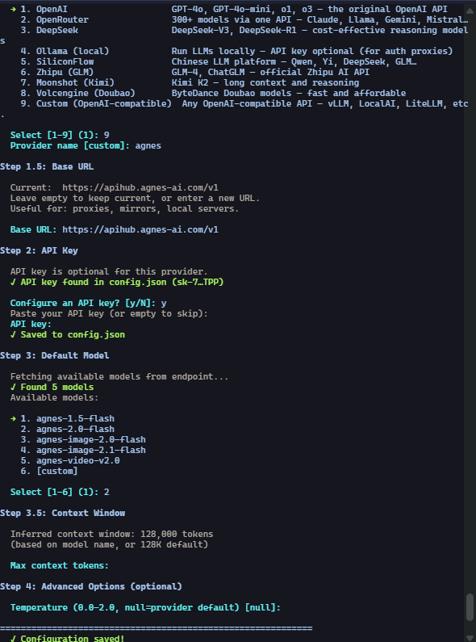
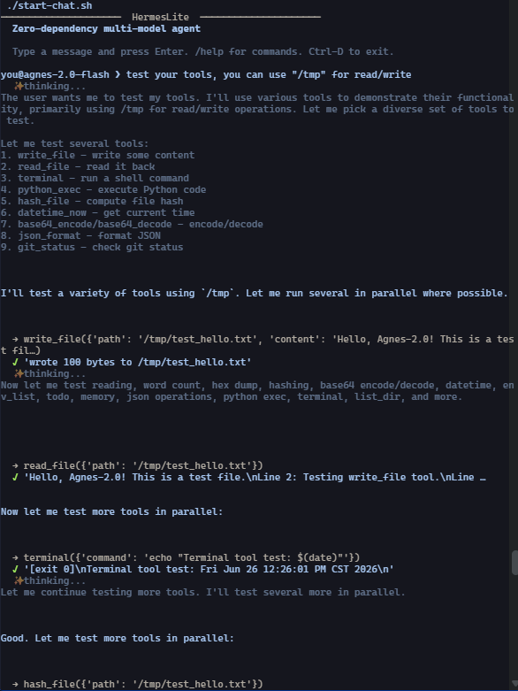
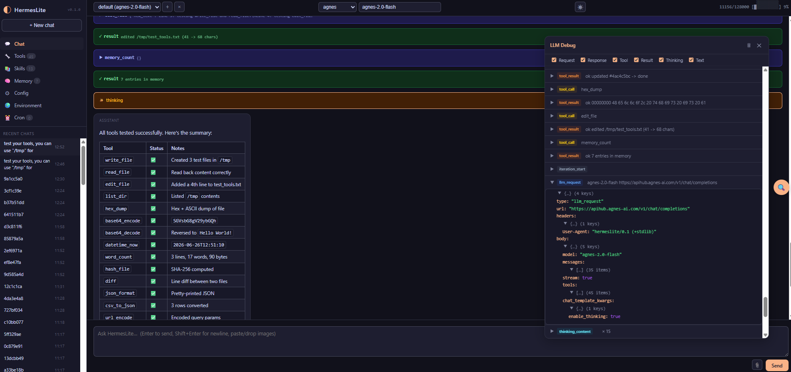

# Hermes-PySTD-Agent

<p align="center"><em>安装 Python，然后直接运行你的 Agent！</em></p>

<p align="center"><a href="./README.md">English</a> | <strong>中文</strong></p>

<p align="center">
  <a href="https://github.com/whaaaaaatt/Hermes-PySTD-Agent/stargazers">
    
  </a>
</p>

<p align="center"><em>如果 Hermes-Lite 对你有帮助，请考虑给个 ⭐ — 这能帮助更多人发现这个项目！</em></p>

---

&emsp;&emsp;**Hermes-PySTD-Agent**（或简称 **Hermes-Lite**）是 [hermes-agent](https://github.com/NousResearch/hermes-agent) 的 **纯 Python 标准库** 重写版。出于网络受限环境下安装原版 hermes-agent 的困难，本项目以简单、零依赖、开箱即用为出发点进行了移植。

### 为什么选择 Hermes-Lite？

| | hermes-agent（原版） | Hermes-Lite |
|---|---|---|
| 代码规模 | ~1600 万行，2082 个文件 | ~1.17 万行，44 个文件 |
| 运行时依赖 | openai, fastapi, typer, httpx, pydantic, rich, … | **无** — 纯 Python 标准库 |
| 配置文件 | `~/.hermes/config.yaml` + `auth.json` | `~/.hermes-lite/config.json` |
| 前端界面 | React + Vite 多页面仪表盘 | 单个 `index.html` + `app.js` + `style.css`（默认暗色主题） |
| 测试 | pytest | 97 个手写测试（< 3 秒） |

### 快速开始

#### 0. 前置条件

&emsp;&emsp;确保系统已安装 Python，然后下载或克隆本仓库到目标机器。Linux/macOS 使用 `.sh` 脚本，Windows 使用 `.bat` 脚本。

#### 1. 配置模型供应商

```bash
./start-setup.sh
```

&emsp;&emsp;根据提示配置模型提供商（API 密钥、模型选择等）。

<p align="center"></p>

<p align="center"><em>我没有尝试过 Anthropic 相关 API 的设置，因为大部分提供商都提供了 OpenAI 兼容接口。</em></p>

#### 2. 启动

**方式一：命令行模式**

```bash
./start-chat.sh
```

&emsp;&emsp;直接在终端中开始聊天，默认会显示思考内容及工具调用信息。输入 `/help` 查看各项斜线命令。

<p align="center"></p>

<p align="center"><em>有点丑，但够用了。</em></p>

**方式二：网页模式（推荐）**

<p align="center">⚠️ 仅在确保网络环境安全的情况下使用此命令。确保他人不会随意访问你的电脑及对应端口。</p>

```bash
./start-web.sh --host 0.0.0.0 --port 8000 --insecure
```

&emsp;&emsp;打开浏览器即可使用。网页界面可以更便捷地查看管理工具、Skill、记忆、配置、环境变量等。聊天界面支持可展开折叠的 System Prompt、思考过程、工具调用等内容。右侧悬浮窗口可查看实际的网络请求，方便调试或二次开发。

<p align="center"></p>

<p align="center"><em>完全显示 Agent 的对话与工作流程。</em></p>

### 更多内容

&emsp;&emsp;其余内容请使用时自行探索，如需联系请发送邮件至 djjsy.xjh@163.com
